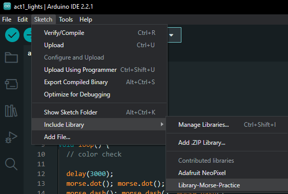

# Example_Library-Morse

Following the tutorial library from [Arduino's Morse Code Library Tutorial](https://docs.arduino.cc/learn/contributions/arduino-creating-library-guide).

This library implements `dot()` and `dash()` functionality which is used in Morse Code. It uses the Adafruit LEDs as visual output.

## Installation

To install this repo as a library:

Pre-requisites:
- [ ] Installed [Ardunio IDE](https://www.arduino.cc/en/software)
- [ ] Installed [Adafruit Neopixel Library](https://github.com/adafruit/Adafruit_NeoPixel)

Instructions:

1. Download repo as `.zip` format
1. In arduino IDE, open: `Sketch/Include Library/Add ZIP Library`
1. Check that the library was installed by visiting `Sketch/Include Library` and checking under "contributed libraries"

Successfully installed library

